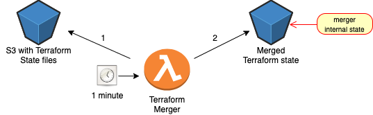

# Terraform Merger is an automatic solution for merging a couple of terraform state files into a single one

In some terraform working methods, there is a usage in more than one state file. Terraform Merger was created to automatically merge an unlimited number of state files into one, and by that to allow TF users more capabilities.
To create a valid merged state file, there are two requirements:
1. All the merged state files must be of the same version and terraform version.
2. Each resource identifier must have a unique name across all pf the state files

### Deploy Terraform Merger to your AWS account
] 

Terraform Merger is easy to use; in order to merge your state files you'll have to follow these steps:
1.  Click
    .
2.  In **Select Template**, click **Next** (no need to make a
    selection)
3.  In **Parameters**, insert the name of the S3 Bucket which stores the .tfstate files, *InputS3Bucket*, then click **Next**
4.  In **Options** page, click **Next** (no need to make any
    selections)
5.  In **Review** page, select the following options:
`I acknowledge that AWS CloudFormation might create IAM resources with custom names.`
6.  Click **Create Stack**

### Set Terraform Merger Arguments
You can control terraform-merger with these parameters:

| Parameter | Description | Optional/Mandatory |
| ------ | ------ | ----- |
| INPUT_BUCKET | Existing S3 Bucket containing sensitive terraform files | Mandatory |
| OUTPUT_BUCKET | S3 Bucket you wish Terraform-merger to write the new merged state file | Mandatory |
| TERRAFORM_STATE_SUFFIX | Defines terraform state files sufix Default value is .tfstate | Optional |
| OUTPUT_DELIMITER | Defines the output delimiter in Output S3 Bucket | Optional |
| HARD_REFRESH | merging all .tfstate files (even if if they already merged) Default value is false | Optional |

## Supported Terraform Versions
- 0.11.X
- 0.12.X
- 0.13.X
- 0.14.X

## Merger is currently supported in N.Virginia (us-east-1)

License
----
Apache 2.0
